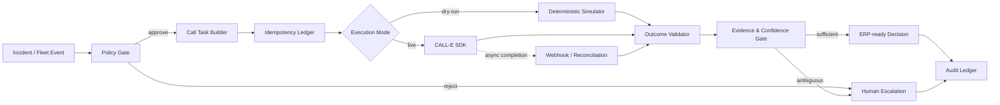

# AegisFleet — Incident Voice Command

**Autonomous, safety-gated phone coordination for logistics exceptions, built with CALL-E.**

AegisFleet turns a logistics incident into a governed phone workflow: validate the incident, create a purpose-bounded call task, obtain a structured outcome, verify evidence, and decide whether the event can return to the operational system or must escalate to a human.

> **Important:** Live calling is opt-in. The default mode is a deterministic local simulation that performs **zero provider calls**.

## Why this exists

Critical logistics work often becomes a telephone problem at the worst possible moment: a route closes, a driver is delayed, a loading slot changes, or a receiving site needs confirmation. A text-only copilot can draft a message but cannot complete the telephone task. CALL-E can execute goal-driven phone work and return structured outcomes. AegisFleet adds the missing enterprise control plane around that capability.

## What is implemented

- **Incident-to-call orchestration** with an explicit policy gate before provider I/O.
- **Dry-run simulation** for judges and developers without a CALL-E account.
- **Live CALL-E adapter** using the TypeScript server SDK when `CALLE_API_KEY` is configured.
- **Strict result contract** using JSON Schema: explicit enums, `unknown` states, evidence, and `additionalProperties: false`.
- **Idempotency ledger** that reserves a stable operation key before a live call is created and prevents accidental duplicate execution after retries.
- **Privacy minimization**: normalized operational identifiers are stored; the demo does not persist full phone numbers or transcripts.
- **Incident state machine**: `detected → validated → approved → calling → resolved | escalated`.
- **Human escalation** for ambiguity, failed calls, insufficient evidence, and policy violations.
- **Webhook skeleton** documenting replay-safe event handling and event-ID deduplication for an asynchronous deployment.
- **Audit trail** with hash-linked records so the demo can prove what decision was made from which evidence.
- **Judge-ready demonstration**: one command produces a complete incident lifecycle and a structured outcome.

## Architecture



## Quick start

```bash
npm install
npm run demo
npm test
npm run typecheck
```

Expected result: a simulated A4 closure incident is validated, a call plan is created in dry-run mode, the driver outcome is parsed, and the system reaches `resolved` without placing a phone call.

## Live CALL-E mode

Create an environment file from `.env.example`, provide your CALL-E credential, and explicitly set `CALL_E_MODE=live`.

```bash
npm run live
```

The application intentionally does **not** fall back from live to dry-run silently. Missing credentials or invalid live configuration cause a clear failure before provider I/O.

## Result contract

The provider response is reduced to a small business object:

```json
{
  "route_acceptance": "yes",
  "eta_update_time": "16:40",
  "escalation_needed": "none",
  "evidence_summary": "Driver confirmed the diversion and gave an ETA of 16:40.",
  "confidence": "high"
}
```

The application treats `unknown` as a real state, never as false, and never invents missing facts.

## Repository layout

```text
.
├── docs/
│   ├── architecture.md
│   ├── security.md
│   ├── grant-proposal.md
│   └── demo-script.md
├── src/
│   ├── domain.ts
│   ├── policy.ts
│   ├── ledger.ts
│   ├── simulator.ts
│   ├── calle.ts
│   ├── orchestrator.ts
│   └── cli.ts
├── tests/
│   ├── policy.test.ts
│   ├── ledger.test.ts
│   └── orchestrator.test.ts
├── package.json
├── tsconfig.json
├── vitest.config.ts
└── .env.example
```

## Relationship to CALL-E

AegisFleet uses CALL-E as the phone-execution layer rather than reimplementing telephony. CALL-E's current integration documentation describes a TypeScript server SDK, structured results, goal-driven calls, IVR handling, and both SDK/API/MCP integration paths. The current MCP flow is `plan_call → run_call → get_call_run`; asynchronous completion should be reconciled rather than duplicated.

## Hackathon submission alignment

The current CALL-E hackathon requires a functional application using CALL-E's API, SDK, MCP, CLI, or Skill; a public demonstration video under three minutes; and a pull request to the `CALLE-AI/awesome-phone-call-agents` repository. AegisFleet is packaged as a reusable TypeScript application contribution and deliberately includes a safe dry-run path for reproducibility.

## Status

**Prototype:** functional local simulation + live adapter scaffolding.

**Production gap:** live provider credentials, deployment URL, and final contribution PR are intentionally environment-specific and are not fabricated in this repository.

## License

MIT
